# 🏗️ Diagrama de Arquitectura - Okuo IA DataLab

## 🔄 Flujo de Datos Completo

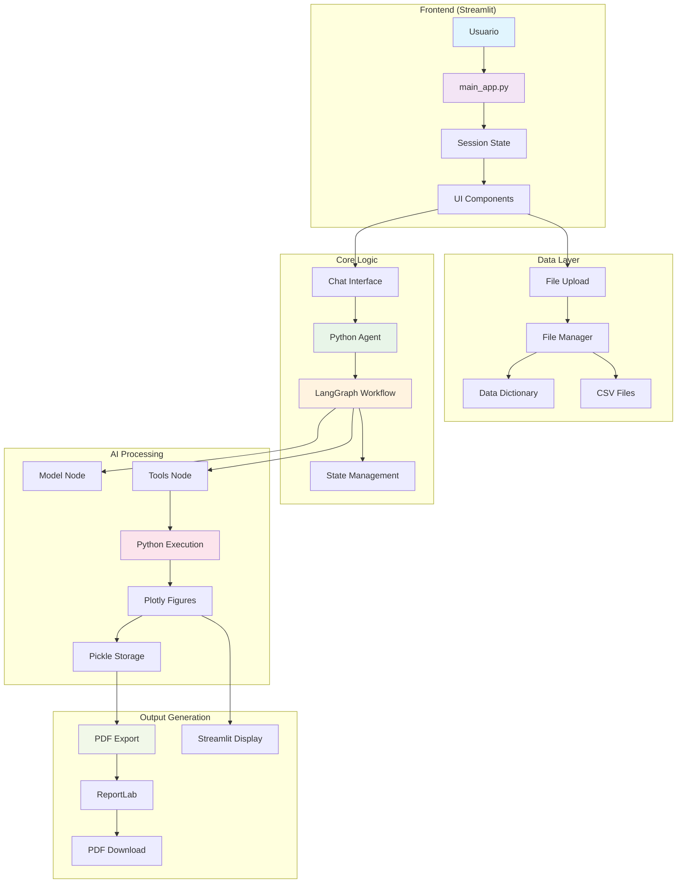

## 🧩 Componentes Detallados

### 1. **Frontend Layer**

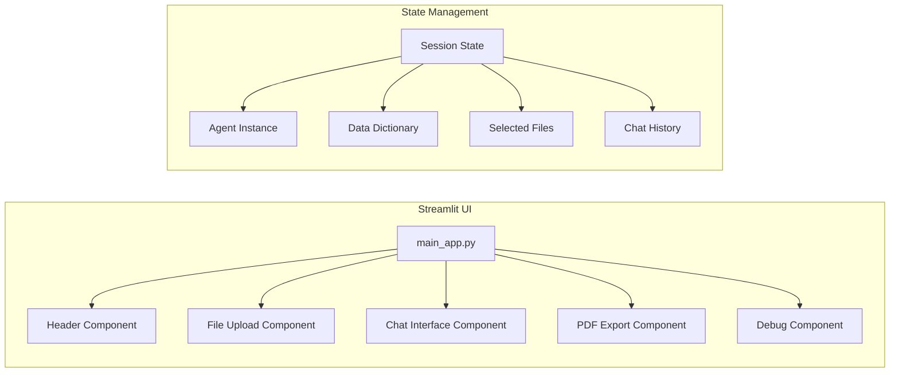

### 2. **Core Agent Architecture**

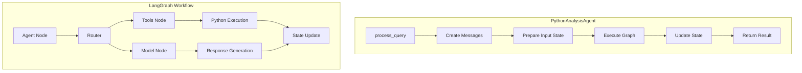

### 3. **Data Flow Architecture**

```mermaid
graph LR
    subgraph "Input Processing"
        A[CSV Upload] --> B[File Validation]
        B --> C[Data Loading]
        C --> D[Data Dictionary Update]
    end
    
    subgraph "Analysis Pipeline"
        D --> E[Query Processing]
        E --> F[Python Code Execution]
        F --> G[Data Analysis]
        G --> H[Visualization Generation]
    end
    
    subgraph "Output Generation"
        H --> I[Plotly Figures]
        I --> J[Pickle Storage]
        J --> K[PDF Generation]
        K --> L[File Download]
    end
```

## 🔧 Herramientas y Dependencias

### Stack Tecnológico

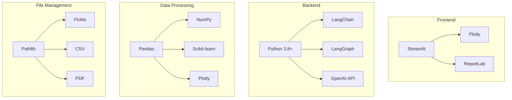

## 📊 Estados del Sistema

### 1. **Estado de la Aplicación**

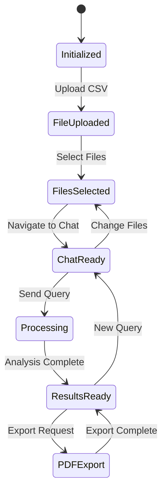

### 2. **Estado del Agente**

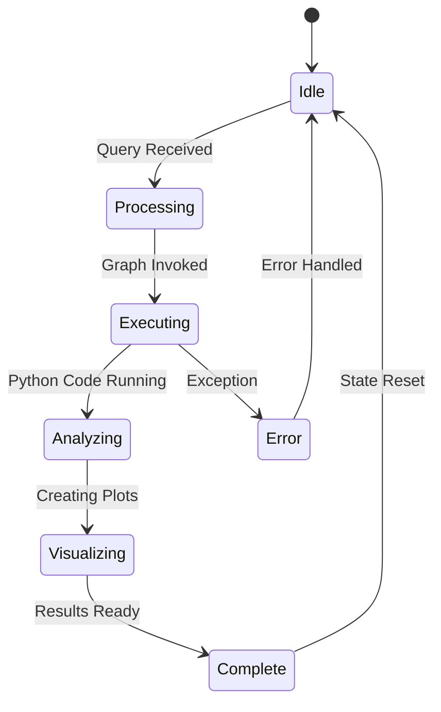

## 🔐 Seguridad y Validación

### Capas de Seguridad

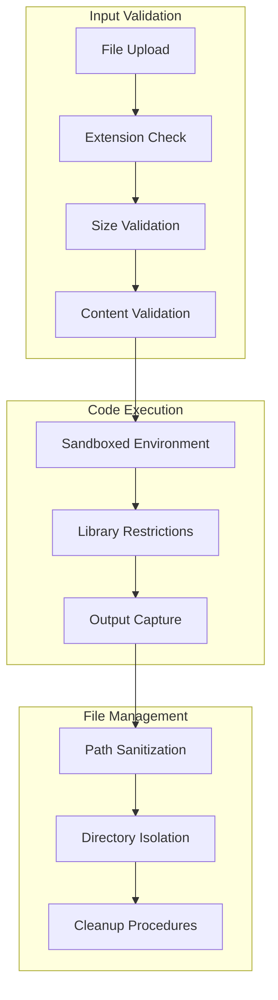

## 📈 Escalabilidad

### Arquitectura Escalable

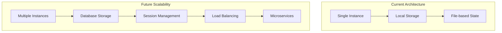

## 🔄 Ciclo de Vida de una Consulta

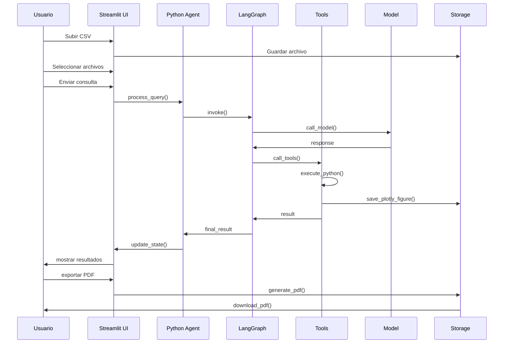

## 🎯 Puntos de Integración

### APIs y Extensiones

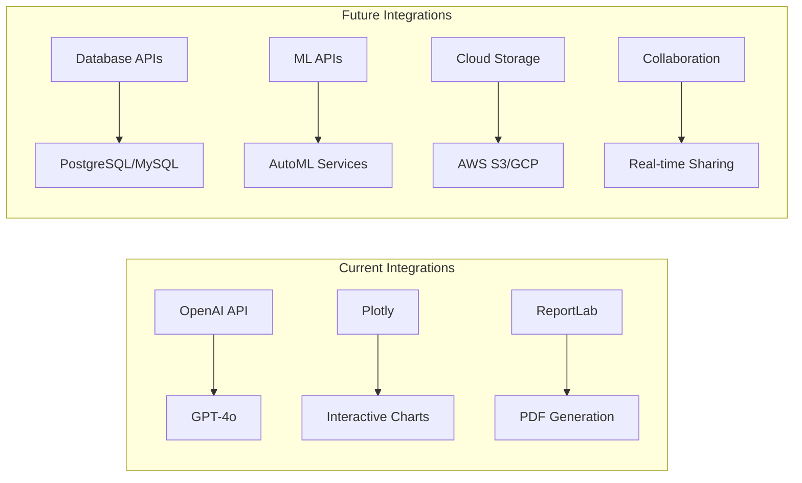

---

*Diagramas generados con Mermaid - Okuo IA DataLab Architecture v1.0.0* 