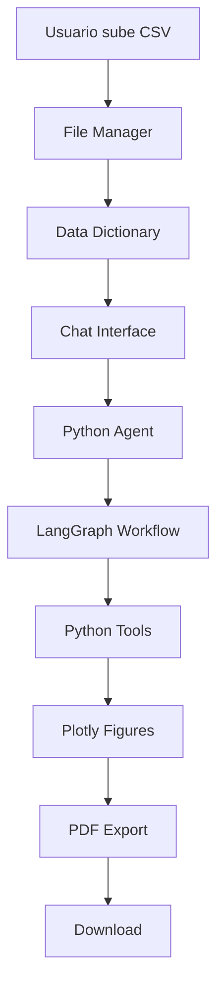

# 📚 Documentación Completa - Okuo IA DataLab

## 🎯 Descripción General

**Okuo IA DataLab** es una aplicación web inteligente para análisis de datos que combina la potencia de la inteligencia artificial con herramientas de visualización avanzadas. Permite a usuarios no técnicos realizar análisis complejos de datos a través de una interfaz conversacional natural.

### 🚀 Características Principales

- **🤖 Análisis Inteligente**: IA conversacional que entiende consultas en lenguaje natural
- **📊 Visualizaciones Automáticas**: Generación automática de gráficos con Plotly
- **📁 Gestión de Datos**: Carga y gestión de archivos CSV
- **📄 Exportación PDF**: Generación de reportes ejecutivos profesionales
- **🔍 Depuración**: Herramientas para entender el proceso de análisis
- **🎨 UI Moderna**: Interfaz intuitiva con Streamlit

---

## 🏗️ Arquitectura del Sistema

### Estructura de Directorios

```
AgenticDataAnalysis/
├── main_app.py                 # Punto de entrada principal
├── setup.py                   # Script de instalación
├── requirements.txt           # Dependencias del proyecto
├── src/                      # Código fuente principal
│   ├── config/              # Configuración de la aplicación
│   ├── core/                # Lógica de negocio central
│   │   ├── agents/          # Agentes de IA
│   │   ├── graph/           # Grafo de flujo de trabajo
│   │   └── prompts/         # Prompts para la IA
│   ├── models/              # Modelos de datos
│   ├── ui/                  # Componentes de interfaz
│   └── utils/               # Utilidades
├── assets/                  # Recursos estáticos
├── dashboard/               # Versión dashboard (legacy)
└── uploads/                 # Archivos subidos por usuarios
```

### 🔄 Flujo de Datos



---

## 🧠 Componentes Principales

### 1. **PythonAnalysisAgent** (`src/core/agents/python_agent.py`)

**Propósito**: Agente principal que coordina el análisis de datos.

**Funcionalidades**:
- ✅ Gestión del estado de la conversación
- ✅ Ejecución del grafo de trabajo LangGraph
- ✅ Manejo de visualizaciones Plotly
- ✅ Persistencia de resultados

**Métodos Clave**:
```python
def process_query(self, user_query: str, input_data: List[InputData]) -> AnalysisResult
def get_chat_history(self) -> List[ChatMessage]
def load_plotly_figure(self, image_path: str) -> plotly.Figure
```

### 2. **LangGraph Workflow** (`src/core/graph/`)

**Propósito**: Define el flujo de trabajo para el procesamiento de consultas.

**Componentes**:
- **`state.py`**: Define el estado del agente
- **`nodes.py`**: Nodos del grafo (modelo, herramientas)
- **`tools.py`**: Herramientas de ejecución de Python

**Flujo**:
1. **Agente** recibe consulta del usuario
2. **Router** decide si usar herramientas
3. **Tools** ejecuta código Python
4. **Modelo** genera respuesta
5. **Ciclo** hasta completar la tarea

### 3. **Modelos de Datos** (`src/models/data_models.py`)

**Clases Principales**:

#### `InputData`
```python
@dataclass
class InputData:
    variable_name: str          # Nombre de la variable
    data_path: Path            # Ruta al archivo
    data_description: str      # Descripción del dataset
    data_frame: Optional[pd.DataFrame]  # DataFrame cargado
```

#### `ChatMessage`
```python
@dataclass
class ChatMessage:
    content: str               # Contenido del mensaje
    sender: str               # "user" o "assistant"
    timestamp: Optional[str]  # Marca de tiempo
```

#### `AnalysisResult`
```python
@dataclass
class AnalysisResult:
    query: str                # Consulta original
    response: str             # Respuesta de la IA
    visualizations: List[str] # Rutas a visualizaciones
    intermediate_outputs: List[Dict]  # Salidas intermedias
```

### 4. **Configuración** (`src/config/settings.py`)

**Propósito**: Centraliza toda la configuración de la aplicación.

**Configuraciones Principales**:
```python
@dataclass
class AppConfig:
    APP_NAME: str = "Okuo IA DataLab"
    BASE_DIR: Path = Path(__file__).parent.parent.parent
    UPLOADS_DIR: Path = ASSETS_DIR / "uploads"
    PLOTLY_FIGURES_DIR: Path = IMAGES_DIR / "plotly_figures" / "pickle"
    OPENAI_API_KEY: Optional[str] = os.getenv("OPENAI_API_KEY")
```

---

## 🎨 Componentes de UI

### 1. **Interfaz Principal** (`main_app.py`)

**Estructura**:
- **Header**: Título y navegación
- **Tabs**: Gestión de Datos, Chat, Depuración
- **Session State**: Manejo de estado de Streamlit

**Funciones Principales**:
```python
def render_data_management_tab()    # Gestión de archivos CSV
def render_chat_tab()              # Interfaz de chat
def render_debug_tab()             # Herramientas de depuración
```

### 2. **Chat Interface** (`src/ui/components/chat_interface.py`)

**Características**:
- ✅ Historial de conversación
- ✅ Visualización de gráficos Plotly
- ✅ Exportación a PDF
- ✅ Depuración de salidas intermedias

### 3. **PDF Export** (`src/ui/components/pdf_export.py`)

**Funcionalidades**:
- ✅ Generación de reportes ejecutivos
- ✅ Inclusión de visualizaciones
- ✅ Estilos profesionales
- ✅ Limpieza automática de archivos temporales

**Proceso**:
1. Carga figuras Plotly desde pickle
2. Convierte a imágenes PNG temporales
3. Genera PDF con ReportLab
4. Limpia archivos temporales

---

## 🔧 Herramientas y Utilidades

### 1. **File Manager** (`src/utils/file_utils.py`)

**Responsabilidades**:
- ✅ Carga y guardado de archivos CSV
- ✅ Gestión del diccionario de datos
- ✅ Validación de extensiones
- ✅ Manejo de rutas absolutas

### 2. **Python Tools** (`src/core/graph/tools.py`)

**Funcionalidad**:
- ✅ Ejecución segura de código Python
- ✅ Captura de salida estándar
- ✅ Persistencia de variables
- ✅ Guardado automático de figuras Plotly

**Librerías Disponibles**:
```python
import pandas as pd
import plotly.graph_objects as go
import plotly.express as px
import sklearn
```

---

## 🎯 Prompts y Configuración de IA

### Prompt Principal (`src/core/prompts/main_prompt.md`)

**Rol**: Científico de datos profesional

**Capacidades**:
- Ejecutar código Python
- Crear visualizaciones
- Explicar conceptos técnicos

**Pautas de Código**:
- Variables persistentes entre ejecuciones
- Uso obligatorio de `print()` para salidas
- Librerías limitadas: pandas, sklearn, plotly

**Paleta de Colores Corporativa**:
1. #1C8074 (PANTONE 3295 U)
2. #666666 (PANTONE 426 U)
3. #1A494C (PANTONE 175-16 U)
4. #94AF92 (PANTONE 7494 U)
5. #E6ECD8 (PANTONE 152-2 U)
6. #C9C9C9 (PANTONE COLOR GRAY 2 U)

---

## 🚀 Instalación y Configuración

### 1. **Requisitos del Sistema**
- Python 3.12+
- pip
- Acceso a internet (para dependencias)

### 2. **Instalación**
```bash
# Clonar repositorio
git clone <repository-url>
cd AgenticDataAnalysis

# Ejecutar setup
python3 setup.py
```

### 3. **Configuración**
```bash
# Editar .env
OPENAI_API_KEY=tu_api_key_aqui
OPENAI_MODEL=gpt-4o
STREAMLIT_PORT=8501
```

### 4. **Ejecución**
```bash
streamlit run main_app.py
```

---

## 🔍 Solución de Problemas

### Error: "No such file or directory: temp_pdf_images/"

**Causa**: Rutas relativas en lugar de absolutas
**Solución**: ✅ **CORREGIDO** - Uso de `config.BASE_DIR / "temp_pdf_images"`

### Error: "Cannot open resource plotly_*.png"

**Causa**: Archivos temporales no encontrados
**Solución**: ✅ **CORREGIDO** - Verificación de existencia de archivos

### Error: "Missing ScriptRunContext"

**Causa**: Ejecutar con `python` en lugar de `streamlit run`
**Solución**: Usar `streamlit run main_app.py`

---

## 📊 Flujo de Uso Típico

### 1. **Carga de Datos**
1. Navegar a "📊 Gestión de Datos"
2. Subir archivos CSV
3. Seleccionar archivos para análisis
4. Agregar descripciones (opcional)

### 2. **Análisis Conversacional**
1. Navegar a "💬 Interfaz de Chat"
2. Hacer preguntas en lenguaje natural
3. Revisar visualizaciones generadas
4. Iterar con preguntas adicionales

### 3. **Exportación de Resultados**
1. Usar botón "📊 Exportar a PDF"
2. Descargar reporte ejecutivo
3. Revisar en "🔍 Depuración" si es necesario

---

## 🔮 Características Futuras

### Planificadas
- [ ] Conexión a bases de datos
- [ ] Análisis de series temporales
- [ ] Machine Learning automático
- [ ] Exportación a múltiples formatos
- [ ] Colaboración en tiempo real

### En Desarrollo
- [ ] Optimización de rendimiento
- [ ] Más tipos de visualizaciones
- [ ] Integración con APIs externas

---

## 🤝 Contribución

### Estructura de Desarrollo
1. **Fork** del repositorio
2. **Branch** para nueva funcionalidad
3. **Commit** con mensajes descriptivos
4. **Pull Request** con documentación

### Estándares de Código
- **Python**: PEP 8
- **Documentación**: Docstrings en español
- **Tests**: Para nuevas funcionalidades
- **Type Hints**: Obligatorios

---

## 📞 Soporte

### Recursos
- **Documentación**: Este archivo
- **Issues**: GitHub Issues
- **Discusiones**: GitHub Discussions

### Contacto
- **Desarrollador**: [Tu información]
- **Email**: [Tu email]
- **Proyecto**: [URL del repositorio]

---

## 📄 Licencia

[Especificar licencia del proyecto]

---

*Documentación generada automáticamente - Okuo IA DataLab v1.0.0* 